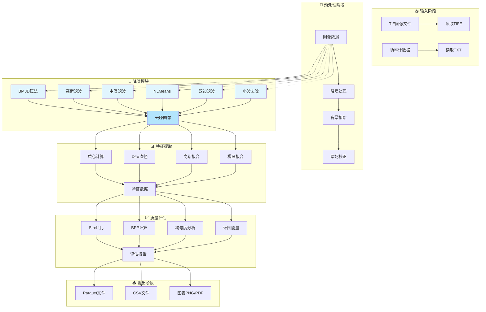

# 数字光学数据分析

一个全面的激光光束质量分析工具包，支持功率数据分析，光束特征提取，光学质量评估和时间序列分析。

## 🚀 主要功能

### 1. 功率数据分析
- **双Sigmoid脉冲拟合**：适用于激光脉冲，光开关响应等带上升沿和下降沿的功率曲线
- **上升/下降时间计算**：10%-90%幅度时间的精确测量
- **时间序列拟合**：支持多种拟合模型（高斯，双误差函数等）

### 2. 图像处理与分析
- **TIFF图像处理**：高效的TIFF格式图像读取和预处理
- **图像降噪算法**：
  - BM3D：先进的块匹配3D滤波算法
  - 高斯/中值/双边滤波：经典降噪方法
  - 非局部均值(NLMeans)：保持纹理的降噪
  - 小波去噪：多尺度分析降噪
  - 全变分/维纳滤波
- **背景扣除**：自动暗场校正
- **质心计算**：基于强度加权的高精度质心定位

### 3. 光束特征提取
- **D4σ直径计算**：基于一阶矩和二阶矩的光斑尺寸测量
- **高斯拟合**：光束横向分布的高斯拟合分析
- **椭圆拟合**：光束形变和椭圆度分析
- **环围能量分析**：指定能量百分比对应的光斑半径计算

### 4. 光学质量评估
- **Strehl比计算**：基于出瞳与焦平面CCD图像的斯特列尔比计算
- **BPP和M²计算**：光束参数积和光束质量因子的精确测量
- **均匀度分析**：四象限均匀度和RMS均匀度评估
- **平顶拟合**：适用于平顶光束的erf平滑边界拟合

### 5. 时间序列分析
- **平稳性检验**：ADF检验判断时间序列平稳性
- **频谱分析**：Lomb-Scargle周期图分析非均匀采样信号
- **趋势分解**：时间序列的趋势、季节性和残差分解
- **自相关分析**：ACF和PACF分析

### 6. 图像配准与位移检测
- **相位相关法**：亚像素精度的图像位移计算
- **光流分析**：光斑运动轨迹追踪

## 🔄 光斑图像处理Pipeline流程



### 降噪算法选择指南

| 场景 | 推荐算法 | 特点 |
|------|---------|------|
| 高质量降噪 | BM3D | 最佳效果，计算较慢 |
| 实时处理 | 高斯滤波 | 速度快，效果一般 |
| 去除椒盐噪声 | 中值滤波 | 快速，保持边缘 |
| 保持纹理 | NLMeans | 效果好，速度较慢 |
| 边缘保持 | 双边滤波 | 保持边缘，速度慢 |
| 多尺度分析 | 小波去噪 | 适合特定场景 |

## 📁 项目结构

```
├── src/data_mining/
│   ├── fitting/
│   │   └── fit_funcs.py          # 拟合函数
│   ├── image/
│   │   ├── common.py             # 通用图像处理
│   │   ├── denoising.py         # 图像降噪模块 ⭐
│   │   ├── process.py           # 图像处理流程
│   │   └── zernike.py           # Zernike多项式
│   ├── experiment_analysis/
│   │   ├── denoise_processor.py # Pipeline降噪集成
│   │   └── pipeline.py          # 处理Pipeline
│   └── services/
│       └── spots_service.py
├── notebooks/
├── tests/
│   ├── test_denoising.py        # 降噪测试
│   └── test_denoise_pipeline.py  # Pipeline测试
└── doc/
```

## 🛠 安装与依赖

### 系统要求
- Python 3.12+
- Windows/Linux/macOS

### 安装
```bash
# 基础依赖
pip install numpy opencv-python

# 完整功能（推荐）
pip install numpy opencv-python bm3d PyWavelets scikit-image
```

### 依赖项
- **必选**: numpy, opencv-python, polars, pandas
- **可选**: 
  - `bm3d` - BM3D降噪算法
  - `PyWavelets` - 小波变换
  - `scikit-image` - 图像质量评估(SSIM)

## 📖 使用指南

### 图像降噪

```python
from data_mining.image.denoising import (
    denoise,           # 统一入口
    bm3d_denoise,     # 快速函数
    gaussian_denoise,
    median_denoise,
    nlmeans_denoise,
    DenoiseMethod
)

# 方法1: 使用统一入口
result = denoise(image, 'bm3d', sigma_psd=25)
denoised = result.image

# 方法2: 使用快速函数
result = bm3d_denoise(image, sigma_psd=25)
result = gaussian_denoise(image, kernel_size=5, sigma=1.5)

# 方法3: 使用枚举
result = denoise(image, DenoiseMethod.NLMEANS, h=10)
```

### Pipeline集成

```python
from data_mining.experiment_analysis import (
    PipelineManager,
    PipelineStage,
    ImageDenoiseProcessor,
    DenoiseProcessorConfig
)

# 配置Pipeline
config = PipelineExecutionConfig(
    stages=[
        PipelineStageConfig(
            stage_name=PipelineStage.DENOISE,
            processor_type=ImageDenoiseProcessor
        )
    ]
)

manager = PipelineManager(config)
result = PipelineExecutor(manager).execute({'images': images})
```

### 光束特征提取

```python
from data_mining.image.common import (
    read_tiff_to_numpy,
    get_profiles,
    d4sigma
)

# 读取图像
image = read_tiff_to_numpy('beam.tif')

# 降噪
from data_mining.image.denoising import gaussian_denoise
denoised = gaussian_denoise(image, kernel_size=5)

# 提取特征
features = d4sigma(denoised)
profiles = get_profiles(denoised, center=(cx, cy))
```

## 🧪 测试

```bash
# 运行所有测试
python -m pytest tests/ -v

# 仅运行降噪测试
python -m pytest tests/test_denoising.py -v

# 仅运行Pipeline测试
python -m pytest tests/test_denoise_pipeline.py -v
```

## 📚 API速查

### 降噪模块

| 函数 | 说明 | 关键参数 |
|-----|------|---------|
| `denoise()` | 统一入口 | method, **kwargs |
| `bm3d_denoise()` | BM3D降噪 | sigma_psd, stage |
| `gaussian_denoise()` | 高斯滤波 | kernel_size, sigma |
| `median_denoise()` | 中值滤波 | kernel_size |
| `nlmeans_denoise()` | 非局部均值 | h, template, search |
| `bilateral_denoise()` | 双边滤波 | d, sigma_color, sigma_space |
| `wavelet_denoise()` | 小波去噪 | wavelet, level |
| `estimate_noise_sigma()` | 噪声估计 | method |

### 质量评估

| 函数 | 说明 |
|-----|------|
| `evaluate_denoising()` | PSNR/SSIM评估 |
| `QualityMetrics` | 质量指标数据类 |

## 📄 许可证

MIT License - 查看 LICENSE 文件了解详情。
