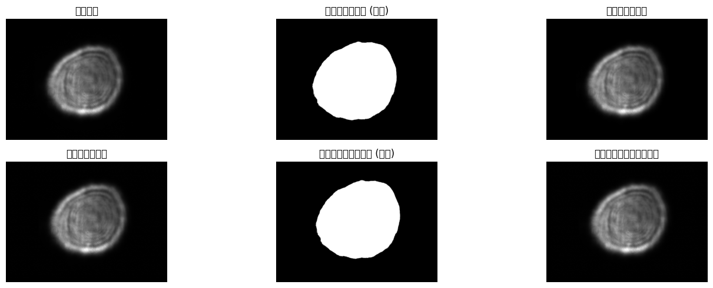
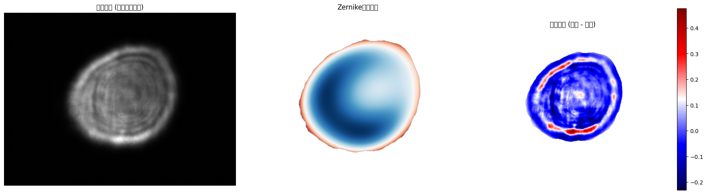
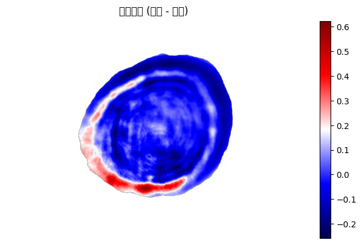

### 泽尼克系数各阶含义

泽尼克多项式通过两个整数索引来定义：径向阶数 **n** 和角向频率 **m**。Noll为了方便，将它们重新排列为一个单一下标 **j**。以下是低阶泽尼克系数（按Noll索引 j 排列）的物理含义，这也是上面代码输出的内容：

| j (Noll) | (n, m) | 系数值的意义 | 中文名称 | 英文名称 |
| :--- | :--- | :--- | :--- | :--- |
| 1 | (0, 0) | 代表整体的平均值或直流分量。在强度拟合中代表光斑平均亮度。 | **活塞 (平移)** | Piston |
| 2 | (1, 1) | 代表沿X轴的线性倾斜。如果系数为正，表示光斑强度在+X方向上增强。 | **X方向倾斜** | X-Tilt |
| 3 | (1, -1) | 代表沿Y轴的线性倾斜。 | **Y方向倾斜** | Y-Tilt |
| 4 | (2, 0) | 代表二次径向变化。正值表示中心亮、边缘暗；负值表示中心暗、边缘亮。 | **离焦** | Defocus |
| 5 | (2, -2) | 代表在45°和135°方向上的像散。形状类似马鞍。 | **45°像散** | Oblique Astigmatism |
| 6 | (2, 2) | 代表在0°和90°（垂直和水平）方向上的像散。 | **0°像散** | Vertical Astigmatism |
| 7 | (3, -1) | 描述一种彗星状的畸变，一侧比另一侧更亮/更暗，沿Y轴分布。 | **垂直彗差** | Vertical Coma |
| 8 | (3, 1) | 沿X轴分布的彗差。 | **水平彗差** | Horizontal Coma |
| 9 | (3, -3) | 描述三叶草形状的强度分布，沿Y轴对称。 | **垂直三叶草** | Vertical Trefoil |
| 10 | (3, 3) | 沿X轴对称的三叶草。 | **倾斜三叶草** | Oblique Trefoil |
| 11 | (4, 0) | 代表更高阶的径向变化，与球差相关。正值会使边缘强度相对于中心进一步降低。 | **球差** | Spherical Aberration |

**总结一下**：

  * **系数的绝对值大小**：表示该项像差或形状特征的强度。绝对值越大，该特征越显著。
  * **系数的符号**：表示该特征的方向。例如，倾斜（Tilt）系数的正负号决定了倾斜的方向。

对于您提到的**干涉条纹**，它们是高频信息。在泽尼克拟合中，这些高频成分会被更高阶的泽尼克项来近似，或者在阶数不够高时，它们会成为拟合的**残差**（Residual），即原始图像与拟合图像的差异。通过观察残差图，可以判断拟合效果以及哪些特征（如干涉条纹）没有被模型很好地捕捉。


```python
import numpy as np
import matplotlib.pyplot as plt
from PIL import Image, ImageDraw
from scipy import ndimage
from scipy.ndimage import shift as ndimage_shift # 导入平移函数
import os
import math

# --- 配置 Matplotlib 显示中文 ---
plt.rcParams['font.sans-serif'] = ['DejaVu Sans']
plt.rcParams['font.family'] = 'DejaVu Sans'
```


```python


# --- 1. 定义Zernike多项式和拟合函数 ---

def cart2pol(x, y):
    """直角坐标转极坐标"""
    rho = np.sqrt(x**2 + y**2)
    phi = np.arctan2(y, x)
    return rho, phi

def zernike_radial_poly(m, n, rho):
    """计算Zernike径向多项式 R_m^n(rho)"""
    if (n - m) % 2:  # 如果 (n-m) 是奇数，则该多项式为0
        return np.zeros_like(rho)
    if abs(m) > n:
        return np.zeros_like(rho)

    poly = np.zeros_like(rho)
    for k in range(0, (n - abs(m)) // 2 + 1):
        coef = ((-1) ** k * math.factorial(n - k)) / (
            math.factorial(k) *
            math.factorial((n + abs(m)) // 2 - k) *
            math.factorial((n - abs(m)) // 2 - k)
        )
        poly += coef * (rho ** (n - 2 * k))
    return poly

def zernike_poly(m, n, rho, phi):
    """计算Zernike多项式 Z_m^n(rho, phi)"""
    R = zernike_radial_poly(m, n, rho)
    if m >= 0:
        return R * np.cos(m * phi)
    else:
        return R * np.sin(-m * phi)

def get_zernike_indices(j):
    """根据Noll索引 j (1-based) 计算对应的 (n, m)"""
    # 使用预计算的查找表，适用于前15个Zernike模式
    noll_to_nm = {
        1: (0, 0), 2: (1, 1), 3: (1, -1), 4: (2, 0),
        5: (2, -2), 6: (2, 2), 7: (3, -1), 8: (3, 1),
        9: (3, -3), 10: (3, 3), 11: (4, 0), 12: (4, 2),
        13: (4, -2), 14: (4, 4), 15: (4, -4)
    }
    return noll_to_nm.get(j, (0, 0)) # 默认返回Piston

def fit_zernike(image, pupil_mask, m_max=4):
    """
    使用最小二乘法将图像拟合到Zernike多项式。
    :param image: 2D numpy array, 输入图像
    :param pupil_mask: 2D numpy boolean array, 有效区域掩码
    :param m_max: int, 最大拟合阶数 (Noll索引)
    :return: coefficients, zernike_modes
    """
    height, width = image.shape
    Y, X = np.mgrid[:height, :width]
    X = (X - (width - 1) / 2) / ((width - 1) / 2) # 归一化到 [-1, 1]
    Y = (Y - (height - 1) / 2) / ((height - 1) / 2) # 归一化到 [-1, 1]

    rho, phi = cart2pol(X, Y)

    # 仅在单位圆内和掩码区域内进行拟合
    valid_indices = (rho <= 1.0) & pupil_mask
    valid_rho = rho[valid_indices]
    valid_phi = phi[valid_indices]
    valid_image = image[valid_indices]

    # 构建设计矩阵 (A matrix)
    num_points = np.sum(valid_indices)
    num_modes = m_max
    A = np.zeros((num_points, num_modes))

    for j in range(1, num_modes + 1):
        n, m = get_zernike_indices(j)
        # Zernike多项式在单位圆上是正交的，但通常不标准正交。
        # 为了简单起见，我们直接使用多项式值。
        # 更精确的方法是使用标准正交基或预先计算归一化系数。
        Z = zernike_poly(m, n, valid_rho, valid_phi)
        A[:, j-1] = Z

    # 使用最小二乘法求解系数 coefficients = (A^T * A)^{-1} * A^T * b
    # 或者使用更稳健的 np.linalg.lstsq
    try:
        coeffs, residuals, rank, s = np.linalg.lstsq(A, valid_image, rcond=None)
    except np.linalg.LinAlgError:
        print("拟合过程中出现线性代数错误，返回零系数。")
        coeffs = np.zeros(num_modes)

    # 重构拟合图像
    fitted_image = np.zeros_like(image, dtype=float)
    zernike_modes = {}
    for j in range(1, num_modes + 1):
        n, m = get_zernike_indices(j)
        Z_full = zernike_poly(m, n, rho, phi)
        fitted_image += coeffs[j-1] * Z_full
        zernike_modes[j] = {'coeff': coeffs[j-1], 'n': n, 'm': m, 'name': ZERNIKE_NAME_MAP.get(j, f"Z^{n}_{{{m}}}")}

    fitted_image[~valid_indices] = np.nan # 非有效区域设为NaN用于可视化

    return coeffs, fitted_image, zernike_modes

# --- 2. 定义Zernike模式名称 ---
ZERNIKE_NAME_MAP = {
    1: "Piston",
    2: "Tilt X",
    3: "Tilt Y",
    4: "Defocus",
    5: "Astigmatism 45°",
    6: "Astigmatism 0°",
    7: "Coma Y",
    8: "Coma X",
    9: "Trefoil Y",
    10: "Trefoil X",
    11: "Primary Spherical",
    12: "Secondary Astigmatism",
    13: "Secondary Astigmatism",
    14: "Tetrafoil 0°",
    15: "Tetrafoil 45°"
}
# --- 3. 新增函数：定位并移动光斑到中心 ---
def find_and_center_spot(image, initial_mask):
    """
    计算光斑的加权质心，并将图像和掩码平移，使质心与图像中心对齐。
    :param image: 2D numpy array, 输入图像 (通常是滤波后的)
    :param initial_mask: 2D numpy boolean array, 初步提取的光斑掩码
    :return: centered_image, centered_mask, (dx, dy)
    """
    h, w = image.shape
    # 1. 计算加权质心 (仅在初步掩码区域内)
    # 使用图像强度作为权重
    weighted_image = np.where(initial_mask, image, 0)
    total_weight = np.sum(weighted_image)

    if total_weight == 0:
        print("警告: 初步掩码区域内总权重为0，无法计算质心。返回原始图像。")
        return image, initial_mask, (0, 0)

    # 计算质心坐标 (基于像素索引)
    y_indices, x_indices = np.mgrid[0:h, 0:w]
    cx = np.sum(x_indices * weighted_image) / total_weight
    cy = np.sum(y_indices * weighted_image) / total_weight

    # 2. 计算需要移动的距离，使质心(cx, cy)移动到图像中心((w-1)/2, (h-1)/2)
    center_x, center_y = (w - 1) / 2.0, (h - 1) / 2.0
    dx = center_x - cx
    dy = center_y - cy

    print(f"检测到的光斑质心: ({cx:.2f}, {cy:.2f})")
    print(f"图像中心: ({center_x}, {center_y})")
    print(f"计算出的平移量: (dx={dx:.2f}, dy={dy:.2f})")

    # 3. 应用平移 (使用 scipy.ndimage.shift)
    # 注意shift的参数顺序是 (shift_y, shift_x)
    # 对原始图像和初步掩码都进行平移
    centered_image = ndimage_shift(image, (dy, dx), order=1, cval=0, prefilter=False)
    centered_mask = ndimage_shift(initial_mask.astype(float), (dy, dx), order=0, cval=0, prefilter=False) > 0.5 # 二值化

    return centered_image, centered_mask, (dx, dy)
# --- 4. 修改后的图像生成函数 ---
def generate_test_image(size=(256, 256)):
    """生成一个带Zernike相差的测试图像 (基础光斑在中心，但图像整体被偏移)"""
    width, height = size

    # 1. 创建一个理论上位于中心的光斑
    Y_cent, X_cent = np.ogrid[:height, :width]
    center_x_true, center_y_true = (width - 1) / 2.0, (height - 1) / 2.0 # 真实中心
    radius = min(width, height) / 2 * 0.85 # 稍微大一点，确保平移后边缘不被裁掉太多

    # 光斑掩码 (基于真实中心)
    mask_cent = (X_cent - center_x_true)**2 + (Y_cent - center_y_true)**2 <= radius**2

    # 2. 在中心创建坐标网格用于计算Zernike多项式
    x_norm = np.linspace(-1, 1, width)
    y_norm = np.linspace(-1, 1, height)
    X_grid, Y_grid = np.meshgrid(x_norm, y_norm)
    rho_grid, phi_grid = cart2pol(X_grid, Y_grid)

    # 3. 定义Zernike系数 (基础相差)
    true_coeffs = {
        1: 0.5,   # Piston
        2: 0.8,
        3: -0.5,
        4: -0.8,  # Defocus
        6: 0.5,   # Astigmatism 0°
        8: 0.3,   # Coma X
        11: 0.4   # Primary Spherical
    }

    # 4. 计算相位图 (在中心坐标系)
    phase_cent = np.zeros_like(rho_grid)
    for j, coeff in true_coeffs.items():
        n, m = get_zernike_indices(j)
        Z = zernike_poly(m, n, rho_grid, phi_grid)
        phase_cent += coeff * Z

    # 5. 应用中心掩码
    phase_cent[~mask_cent] = 0

    # 6. 生成中心光斑的强度图像
    intensity_cent = (1 + np.cos(20 * rho_grid + phase_cent)) / 2.0
    intensity_cent[~mask_cent] = 0
    intensity_cent = np.clip(intensity_cent, 0, 1)

    # 7. 转换为中心光斑的图像数组
    img_array_cent = (intensity_cent * 255).astype(np.uint8)
    img_array_cent_with_noise = img_array_cent + np.random.poisson(2, size=img_array_cent.shape)
    img_array_cent_with_noise = np.clip(img_array_cent_with_noise, 0, 255).astype(np.uint8)

    # 8. 【关键步骤】为了模拟偏移，将整个生成的图像和掩码移动一个固定的偏移量
    # 这个偏移量是用户定义的，用于测试 find_and_center_spot 功能
    intentional_dx, intentional_dy = 25, -15 # 故意设置的偏移量
    print(f"为了测试居中功能，人为将图像移动了 ({intentional_dx}, {intentional_dy})")

    # 应用反向平移来模拟偏移 (因为shift是将内容移动到新位置，所以要移动 -offset 来模拟原图在 offset 位置)
    final_image_array = ndimage_shift(img_array_cent_with_noise.astype(float), (-intentional_dy, -intentional_dx), order=1, cval=0, prefilter=False).astype(np.uint8)
    final_mask = ndimage_shift(mask_cent.astype(float), (-intentional_dy, -intentional_dx), order=0, cval=0, prefilter=False) > 0.5

    return final_image_array, final_mask, true_coeffs # 返回偏移后的图像、掩码和理论系数

```


```python
root_dir = "/home/tifo/workspace/data/daily_data/"
image_path = root_dir+"20250611/20250611001/digitaloptical4Floor/光瞳image/20250611 14：50：05(全子束弱光平顶)/20250611 14：50：06.86(全子束弱光平顶).TIFF"

img = Image.open(image_path).convert('L')
image_array = np.array(img)
# 强度归一化，将图像值映射到[0, 1]范围
intens_min, intens_max = np.min(image_array), np.max(image_array)
image_array = (image_array - intens_min) / (intens_max - intens_min)

# 从加载的图像中提取初步掩码
threshold = np.mean(image_array[image_array > 0]) * 0.3
pupil_mask = image_array > threshold

print(f"图像尺寸: {image_array.shape}")

# 可视化原始图像和掩码
fig, axs = plt.subplots(2, 3, figsize=(15, 5))
axs[0,0].imshow(image_array, cmap='gray')
axs[0,0].set_title('原始图像')
axs[0,0].axis('off')

axs[0,1].imshow(pupil_mask, cmap='gray')
axs[0,1].set_title('提取的光斑区域 (掩码)')
axs[0,1].axis('off')

# 图像预处理 (高斯滤波)
sigma = 1.0
image_filtered = ndimage.gaussian_filter(image_array.astype(float), sigma=sigma)
print(f"已应用高斯滤波 (sigma={sigma})")

axs[0,2].imshow(image_filtered, cmap='gray')
axs[0,2].set_title('高斯滤波后图像')
axs[0,2].axis('off')
 # --- 新增步骤: 定位并移动光斑到中心 ---
print("\n--- 正在将光斑移动到图像中心 ---")
centered_image, centered_mask, (dx, dy) = find_and_center_spot(image_filtered, pupil_mask)
print("-----------------------------------\n")

# 可视化居中后的图像和掩码
axs[1, 0].imshow(centered_image, cmap='gray')
axs[1, 0].set_title('【居中后】图像')
axs[1, 0].axis('off')

axs[1, 1].imshow(centered_mask, cmap='gray')
axs[1, 1].set_title('【居中后】光斑区域 (掩码)')
axs[1, 1].axis('off')

# 对居中后的图像再次应用高斯滤波（可选，但保持一致性）
centered_image_filtered = ndimage.gaussian_filter(centered_image, sigma=sigma)
axs[1, 2].imshow(centered_image_filtered, cmap='gray')
axs[1, 2].set_title('【居中后】高斯滤波图像')
axs[1, 2].axis('off')

plt.tight_layout()
plt.show()
```

    图像尺寸: (1944, 2592)
    已应用高斯滤波 (sigma=1.0)
    
    --- 正在将光斑移动到图像中心 ---
    检测到的光斑质心: (1240.54, 1030.87)
    图像中心: (1295.5, 971.5)
    计算出的平移量: (dx=54.96, dy=-59.37)
    -----------------------------------
    


    /tmp/ipykernel_22686/1438911703.py:54: UserWarning: Glyph 21407 (\N{CJK UNIFIED IDEOGRAPH-539F}) missing from font(s) DejaVu Sans.
      plt.tight_layout()
    /tmp/ipykernel_22686/1438911703.py:54: UserWarning: Glyph 22987 (\N{CJK UNIFIED IDEOGRAPH-59CB}) missing from font(s) DejaVu Sans.
      plt.tight_layout()
    /tmp/ipykernel_22686/1438911703.py:54: UserWarning: Glyph 22270 (\N{CJK UNIFIED IDEOGRAPH-56FE}) missing from font(s) DejaVu Sans.
      plt.tight_layout()
    /tmp/ipykernel_22686/1438911703.py:54: UserWarning: Glyph 20687 (\N{CJK UNIFIED IDEOGRAPH-50CF}) missing from font(s) DejaVu Sans.
      plt.tight_layout()
    /tmp/ipykernel_22686/1438911703.py:54: UserWarning: Glyph 25552 (\N{CJK UNIFIED IDEOGRAPH-63D0}) missing from font(s) DejaVu Sans.
      plt.tight_layout()
    /tmp/ipykernel_22686/1438911703.py:54: UserWarning: Glyph 21462 (\N{CJK UNIFIED IDEOGRAPH-53D6}) missing from font(s) DejaVu Sans.
      plt.tight_layout()
    /tmp/ipykernel_22686/1438911703.py:54: UserWarning: Glyph 30340 (\N{CJK UNIFIED IDEOGRAPH-7684}) missing from font(s) DejaVu Sans.
      plt.tight_layout()
    /tmp/ipykernel_22686/1438911703.py:54: UserWarning: Glyph 20809 (\N{CJK UNIFIED IDEOGRAPH-5149}) missing from font(s) DejaVu Sans.
      plt.tight_layout()
    /tmp/ipykernel_22686/1438911703.py:54: UserWarning: Glyph 26001 (\N{CJK UNIFIED IDEOGRAPH-6591}) missing from font(s) DejaVu Sans.
      plt.tight_layout()
    /tmp/ipykernel_22686/1438911703.py:54: UserWarning: Glyph 21306 (\N{CJK UNIFIED IDEOGRAPH-533A}) missing from font(s) DejaVu Sans.
      plt.tight_layout()
    /tmp/ipykernel_22686/1438911703.py:54: UserWarning: Glyph 22495 (\N{CJK UNIFIED IDEOGRAPH-57DF}) missing from font(s) DejaVu Sans.
      plt.tight_layout()
    /tmp/ipykernel_22686/1438911703.py:54: UserWarning: Glyph 25513 (\N{CJK UNIFIED IDEOGRAPH-63A9}) missing from font(s) DejaVu Sans.
      plt.tight_layout()
    /tmp/ipykernel_22686/1438911703.py:54: UserWarning: Glyph 30721 (\N{CJK UNIFIED IDEOGRAPH-7801}) missing from font(s) DejaVu Sans.
      plt.tight_layout()
    /tmp/ipykernel_22686/1438911703.py:54: UserWarning: Glyph 39640 (\N{CJK UNIFIED IDEOGRAPH-9AD8}) missing from font(s) DejaVu Sans.
      plt.tight_layout()
    /tmp/ipykernel_22686/1438911703.py:54: UserWarning: Glyph 26031 (\N{CJK UNIFIED IDEOGRAPH-65AF}) missing from font(s) DejaVu Sans.
      plt.tight_layout()
    /tmp/ipykernel_22686/1438911703.py:54: UserWarning: Glyph 28388 (\N{CJK UNIFIED IDEOGRAPH-6EE4}) missing from font(s) DejaVu Sans.
      plt.tight_layout()
    /tmp/ipykernel_22686/1438911703.py:54: UserWarning: Glyph 27874 (\N{CJK UNIFIED IDEOGRAPH-6CE2}) missing from font(s) DejaVu Sans.
      plt.tight_layout()
    /tmp/ipykernel_22686/1438911703.py:54: UserWarning: Glyph 21518 (\N{CJK UNIFIED IDEOGRAPH-540E}) missing from font(s) DejaVu Sans.
      plt.tight_layout()
    /tmp/ipykernel_22686/1438911703.py:54: UserWarning: Glyph 12304 (\N{LEFT BLACK LENTICULAR BRACKET}) missing from font(s) DejaVu Sans.
      plt.tight_layout()
    /tmp/ipykernel_22686/1438911703.py:54: UserWarning: Glyph 23621 (\N{CJK UNIFIED IDEOGRAPH-5C45}) missing from font(s) DejaVu Sans.
      plt.tight_layout()
    /tmp/ipykernel_22686/1438911703.py:54: UserWarning: Glyph 20013 (\N{CJK UNIFIED IDEOGRAPH-4E2D}) missing from font(s) DejaVu Sans.
      plt.tight_layout()
    /tmp/ipykernel_22686/1438911703.py:54: UserWarning: Glyph 12305 (\N{RIGHT BLACK LENTICULAR BRACKET}) missing from font(s) DejaVu Sans.
      plt.tight_layout()
    /home/tifo/miniconda3/envs/data/lib/python3.10/site-packages/IPython/core/pylabtools.py:170: UserWarning: Glyph 21407 (\N{CJK UNIFIED IDEOGRAPH-539F}) missing from font(s) DejaVu Sans.
      fig.canvas.print_figure(bytes_io, **kw)
    /home/tifo/miniconda3/envs/data/lib/python3.10/site-packages/IPython/core/pylabtools.py:170: UserWarning: Glyph 22987 (\N{CJK UNIFIED IDEOGRAPH-59CB}) missing from font(s) DejaVu Sans.
      fig.canvas.print_figure(bytes_io, **kw)
    /home/tifo/miniconda3/envs/data/lib/python3.10/site-packages/IPython/core/pylabtools.py:170: UserWarning: Glyph 22270 (\N{CJK UNIFIED IDEOGRAPH-56FE}) missing from font(s) DejaVu Sans.
      fig.canvas.print_figure(bytes_io, **kw)
    /home/tifo/miniconda3/envs/data/lib/python3.10/site-packages/IPython/core/pylabtools.py:170: UserWarning: Glyph 20687 (\N{CJK UNIFIED IDEOGRAPH-50CF}) missing from font(s) DejaVu Sans.
      fig.canvas.print_figure(bytes_io, **kw)
    /home/tifo/miniconda3/envs/data/lib/python3.10/site-packages/IPython/core/pylabtools.py:170: UserWarning: Glyph 25552 (\N{CJK UNIFIED IDEOGRAPH-63D0}) missing from font(s) DejaVu Sans.
      fig.canvas.print_figure(bytes_io, **kw)
    /home/tifo/miniconda3/envs/data/lib/python3.10/site-packages/IPython/core/pylabtools.py:170: UserWarning: Glyph 21462 (\N{CJK UNIFIED IDEOGRAPH-53D6}) missing from font(s) DejaVu Sans.
      fig.canvas.print_figure(bytes_io, **kw)
    /home/tifo/miniconda3/envs/data/lib/python3.10/site-packages/IPython/core/pylabtools.py:170: UserWarning: Glyph 30340 (\N{CJK UNIFIED IDEOGRAPH-7684}) missing from font(s) DejaVu Sans.
      fig.canvas.print_figure(bytes_io, **kw)
    /home/tifo/miniconda3/envs/data/lib/python3.10/site-packages/IPython/core/pylabtools.py:170: UserWarning: Glyph 20809 (\N{CJK UNIFIED IDEOGRAPH-5149}) missing from font(s) DejaVu Sans.
      fig.canvas.print_figure(bytes_io, **kw)
    /home/tifo/miniconda3/envs/data/lib/python3.10/site-packages/IPython/core/pylabtools.py:170: UserWarning: Glyph 26001 (\N{CJK UNIFIED IDEOGRAPH-6591}) missing from font(s) DejaVu Sans.
      fig.canvas.print_figure(bytes_io, **kw)
    /home/tifo/miniconda3/envs/data/lib/python3.10/site-packages/IPython/core/pylabtools.py:170: UserWarning: Glyph 21306 (\N{CJK UNIFIED IDEOGRAPH-533A}) missing from font(s) DejaVu Sans.
      fig.canvas.print_figure(bytes_io, **kw)
    /home/tifo/miniconda3/envs/data/lib/python3.10/site-packages/IPython/core/pylabtools.py:170: UserWarning: Glyph 22495 (\N{CJK UNIFIED IDEOGRAPH-57DF}) missing from font(s) DejaVu Sans.
      fig.canvas.print_figure(bytes_io, **kw)
    /home/tifo/miniconda3/envs/data/lib/python3.10/site-packages/IPython/core/pylabtools.py:170: UserWarning: Glyph 25513 (\N{CJK UNIFIED IDEOGRAPH-63A9}) missing from font(s) DejaVu Sans.
      fig.canvas.print_figure(bytes_io, **kw)
    /home/tifo/miniconda3/envs/data/lib/python3.10/site-packages/IPython/core/pylabtools.py:170: UserWarning: Glyph 30721 (\N{CJK UNIFIED IDEOGRAPH-7801}) missing from font(s) DejaVu Sans.
      fig.canvas.print_figure(bytes_io, **kw)
    /home/tifo/miniconda3/envs/data/lib/python3.10/site-packages/IPython/core/pylabtools.py:170: UserWarning: Glyph 39640 (\N{CJK UNIFIED IDEOGRAPH-9AD8}) missing from font(s) DejaVu Sans.
      fig.canvas.print_figure(bytes_io, **kw)
    /home/tifo/miniconda3/envs/data/lib/python3.10/site-packages/IPython/core/pylabtools.py:170: UserWarning: Glyph 26031 (\N{CJK UNIFIED IDEOGRAPH-65AF}) missing from font(s) DejaVu Sans.
      fig.canvas.print_figure(bytes_io, **kw)
    /home/tifo/miniconda3/envs/data/lib/python3.10/site-packages/IPython/core/pylabtools.py:170: UserWarning: Glyph 28388 (\N{CJK UNIFIED IDEOGRAPH-6EE4}) missing from font(s) DejaVu Sans.
      fig.canvas.print_figure(bytes_io, **kw)
    /home/tifo/miniconda3/envs/data/lib/python3.10/site-packages/IPython/core/pylabtools.py:170: UserWarning: Glyph 27874 (\N{CJK UNIFIED IDEOGRAPH-6CE2}) missing from font(s) DejaVu Sans.
      fig.canvas.print_figure(bytes_io, **kw)
    /home/tifo/miniconda3/envs/data/lib/python3.10/site-packages/IPython/core/pylabtools.py:170: UserWarning: Glyph 21518 (\N{CJK UNIFIED IDEOGRAPH-540E}) missing from font(s) DejaVu Sans.
      fig.canvas.print_figure(bytes_io, **kw)
    /home/tifo/miniconda3/envs/data/lib/python3.10/site-packages/IPython/core/pylabtools.py:170: UserWarning: Glyph 12304 (\N{LEFT BLACK LENTICULAR BRACKET}) missing from font(s) DejaVu Sans.
      fig.canvas.print_figure(bytes_io, **kw)
    /home/tifo/miniconda3/envs/data/lib/python3.10/site-packages/IPython/core/pylabtools.py:170: UserWarning: Glyph 23621 (\N{CJK UNIFIED IDEOGRAPH-5C45}) missing from font(s) DejaVu Sans.
      fig.canvas.print_figure(bytes_io, **kw)
    /home/tifo/miniconda3/envs/data/lib/python3.10/site-packages/IPython/core/pylabtools.py:170: UserWarning: Glyph 20013 (\N{CJK UNIFIED IDEOGRAPH-4E2D}) missing from font(s) DejaVu Sans.
      fig.canvas.print_figure(bytes_io, **kw)
    /home/tifo/miniconda3/envs/data/lib/python3.10/site-packages/IPython/core/pylabtools.py:170: UserWarning: Glyph 12305 (\N{RIGHT BLACK LENTICULAR BRACKET}) missing from font(s) DejaVu Sans.
      fig.canvas.print_figure(bytes_io, **kw)


    

    


```python
# --- 在居中后的图像上执行Zernike拟合 ---
M = 15 # 拟合到11阶（包含前11个Zernike模式）
print(f"正在进行Zernike拟合 (拟合前 {M} 项)...")
try:
    coefficients, fitted_image, zernike_modes = fit_zernike(centered_image_filtered, centered_mask, m_max=M)
    print("拟合完成。")
except Exception as e:
    print(f"拟合过程中出错: {e}")

# 可视化最终拟合结果
fig, axs = plt.subplots(1, 3, figsize=(18, 6))
axs[0].imshow(centered_image_filtered, cmap='gray')
axs[0].set_title('输入图像 (居中且滤波后)')
axs[0].axis('off')

axs[1].imshow(fitted_image, cmap='RdBu')
axs[1].set_title('Zernike拟合结果')
axs[1].axis('off')

residual = centered_image_filtered - fitted_image
im_residual = axs[2].imshow(residual, cmap='seismic')
axs[2].set_title('拟合残差 (原始 - 拟合)')
axs[2].axis('off')
plt.colorbar(im_residual, ax=axs[2], shrink=0.8)

plt.tight_layout()
plt.show()

```

    正在进行Zernike拟合 (拟合前 15 项)...
    拟合完成。


    /tmp/ipykernel_22686/2717141525.py:26: UserWarning: Glyph 36755 (\N{CJK UNIFIED IDEOGRAPH-8F93}) missing from font(s) DejaVu Sans.
      plt.tight_layout()
    /tmp/ipykernel_22686/2717141525.py:26: UserWarning: Glyph 20837 (\N{CJK UNIFIED IDEOGRAPH-5165}) missing from font(s) DejaVu Sans.
      plt.tight_layout()
    /tmp/ipykernel_22686/2717141525.py:26: UserWarning: Glyph 22270 (\N{CJK UNIFIED IDEOGRAPH-56FE}) missing from font(s) DejaVu Sans.
      plt.tight_layout()
    /tmp/ipykernel_22686/2717141525.py:26: UserWarning: Glyph 20687 (\N{CJK UNIFIED IDEOGRAPH-50CF}) missing from font(s) DejaVu Sans.
      plt.tight_layout()
    /tmp/ipykernel_22686/2717141525.py:26: UserWarning: Glyph 23621 (\N{CJK UNIFIED IDEOGRAPH-5C45}) missing from font(s) DejaVu Sans.
      plt.tight_layout()
    /tmp/ipykernel_22686/2717141525.py:26: UserWarning: Glyph 20013 (\N{CJK UNIFIED IDEOGRAPH-4E2D}) missing from font(s) DejaVu Sans.
      plt.tight_layout()
    /tmp/ipykernel_22686/2717141525.py:26: UserWarning: Glyph 19988 (\N{CJK UNIFIED IDEOGRAPH-4E14}) missing from font(s) DejaVu Sans.
      plt.tight_layout()
    /tmp/ipykernel_22686/2717141525.py:26: UserWarning: Glyph 28388 (\N{CJK UNIFIED IDEOGRAPH-6EE4}) missing from font(s) DejaVu Sans.
      plt.tight_layout()
    /tmp/ipykernel_22686/2717141525.py:26: UserWarning: Glyph 27874 (\N{CJK UNIFIED IDEOGRAPH-6CE2}) missing from font(s) DejaVu Sans.
      plt.tight_layout()
    /tmp/ipykernel_22686/2717141525.py:26: UserWarning: Glyph 21518 (\N{CJK UNIFIED IDEOGRAPH-540E}) missing from font(s) DejaVu Sans.
      plt.tight_layout()
    /tmp/ipykernel_22686/2717141525.py:26: UserWarning: Glyph 25311 (\N{CJK UNIFIED IDEOGRAPH-62DF}) missing from font(s) DejaVu Sans.
      plt.tight_layout()
    /tmp/ipykernel_22686/2717141525.py:26: UserWarning: Glyph 21512 (\N{CJK UNIFIED IDEOGRAPH-5408}) missing from font(s) DejaVu Sans.
      plt.tight_layout()
    /tmp/ipykernel_22686/2717141525.py:26: UserWarning: Glyph 32467 (\N{CJK UNIFIED IDEOGRAPH-7ED3}) missing from font(s) DejaVu Sans.
      plt.tight_layout()
    /tmp/ipykernel_22686/2717141525.py:26: UserWarning: Glyph 26524 (\N{CJK UNIFIED IDEOGRAPH-679C}) missing from font(s) DejaVu Sans.
      plt.tight_layout()
    /tmp/ipykernel_22686/2717141525.py:26: UserWarning: Glyph 27531 (\N{CJK UNIFIED IDEOGRAPH-6B8B}) missing from font(s) DejaVu Sans.
      plt.tight_layout()
    /tmp/ipykernel_22686/2717141525.py:26: UserWarning: Glyph 24046 (\N{CJK UNIFIED IDEOGRAPH-5DEE}) missing from font(s) DejaVu Sans.
      plt.tight_layout()
    /tmp/ipykernel_22686/2717141525.py:26: UserWarning: Glyph 21407 (\N{CJK UNIFIED IDEOGRAPH-539F}) missing from font(s) DejaVu Sans.
      plt.tight_layout()
    /tmp/ipykernel_22686/2717141525.py:26: UserWarning: Glyph 22987 (\N{CJK UNIFIED IDEOGRAPH-59CB}) missing from font(s) DejaVu Sans.
      plt.tight_layout()
    /home/tifo/miniconda3/envs/data/lib/python3.10/site-packages/IPython/core/pylabtools.py:170: UserWarning: Glyph 36755 (\N{CJK UNIFIED IDEOGRAPH-8F93}) missing from font(s) DejaVu Sans.
      fig.canvas.print_figure(bytes_io, **kw)
    /home/tifo/miniconda3/envs/data/lib/python3.10/site-packages/IPython/core/pylabtools.py:170: UserWarning: Glyph 20837 (\N{CJK UNIFIED IDEOGRAPH-5165}) missing from font(s) DejaVu Sans.
      fig.canvas.print_figure(bytes_io, **kw)
    /home/tifo/miniconda3/envs/data/lib/python3.10/site-packages/IPython/core/pylabtools.py:170: UserWarning: Glyph 19988 (\N{CJK UNIFIED IDEOGRAPH-4E14}) missing from font(s) DejaVu Sans.
      fig.canvas.print_figure(bytes_io, **kw)
    /home/tifo/miniconda3/envs/data/lib/python3.10/site-packages/IPython/core/pylabtools.py:170: UserWarning: Glyph 25311 (\N{CJK UNIFIED IDEOGRAPH-62DF}) missing from font(s) DejaVu Sans.
      fig.canvas.print_figure(bytes_io, **kw)
    /home/tifo/miniconda3/envs/data/lib/python3.10/site-packages/IPython/core/pylabtools.py:170: UserWarning: Glyph 21512 (\N{CJK UNIFIED IDEOGRAPH-5408}) missing from font(s) DejaVu Sans.
      fig.canvas.print_figure(bytes_io, **kw)
    /home/tifo/miniconda3/envs/data/lib/python3.10/site-packages/IPython/core/pylabtools.py:170: UserWarning: Glyph 32467 (\N{CJK UNIFIED IDEOGRAPH-7ED3}) missing from font(s) DejaVu Sans.
      fig.canvas.print_figure(bytes_io, **kw)
    /home/tifo/miniconda3/envs/data/lib/python3.10/site-packages/IPython/core/pylabtools.py:170: UserWarning: Glyph 26524 (\N{CJK UNIFIED IDEOGRAPH-679C}) missing from font(s) DejaVu Sans.
      fig.canvas.print_figure(bytes_io, **kw)
    /home/tifo/miniconda3/envs/data/lib/python3.10/site-packages/IPython/core/pylabtools.py:170: UserWarning: Glyph 27531 (\N{CJK UNIFIED IDEOGRAPH-6B8B}) missing from font(s) DejaVu Sans.
      fig.canvas.print_figure(bytes_io, **kw)
    /home/tifo/miniconda3/envs/data/lib/python3.10/site-packages/IPython/core/pylabtools.py:170: UserWarning: Glyph 24046 (\N{CJK UNIFIED IDEOGRAPH-5DEE}) missing from font(s) DejaVu Sans.
      fig.canvas.print_figure(bytes_io, **kw)


    

    


```python

# 计算并显示残差
residual = image_filtered - fitted_image
im_residual = plt.imshow(residual, cmap='seismic')
plt.title('拟合残差 (原始 - 拟合)')
plt.axis('off')
plt.colorbar(im_residual, shrink=0.8)

plt.tight_layout()
plt.show()

# 输出Zernike系数及其含义
print("\n--- 计算得到的Zernike系数 ---")
print(f"{'Noll':<6} {'(n,m)':<10} {'Name':<25} {'Coefficient':<15}")
print("-" * 60)
for j in range(1, M+1):
    mode_info = zernike_modes[j]
    print(f"{j:<6} ({mode_info['n']},{mode_info['m']:<3}) {mode_info['name']:<25} {mode_info['coeff']:<15.6f}")
print("-" * 60)
```

    /tmp/ipykernel_22686/667436602.py:8: UserWarning: Glyph 25311 (\N{CJK UNIFIED IDEOGRAPH-62DF}) missing from font(s) DejaVu Sans.
      plt.tight_layout()
    /tmp/ipykernel_22686/667436602.py:8: UserWarning: Glyph 21512 (\N{CJK UNIFIED IDEOGRAPH-5408}) missing from font(s) DejaVu Sans.
      plt.tight_layout()
    /tmp/ipykernel_22686/667436602.py:8: UserWarning: Glyph 27531 (\N{CJK UNIFIED IDEOGRAPH-6B8B}) missing from font(s) DejaVu Sans.
      plt.tight_layout()
    /tmp/ipykernel_22686/667436602.py:8: UserWarning: Glyph 24046 (\N{CJK UNIFIED IDEOGRAPH-5DEE}) missing from font(s) DejaVu Sans.
      plt.tight_layout()
    /tmp/ipykernel_22686/667436602.py:8: UserWarning: Glyph 21407 (\N{CJK UNIFIED IDEOGRAPH-539F}) missing from font(s) DejaVu Sans.
      plt.tight_layout()
    /tmp/ipykernel_22686/667436602.py:8: UserWarning: Glyph 22987 (\N{CJK UNIFIED IDEOGRAPH-59CB}) missing from font(s) DejaVu Sans.
      plt.tight_layout()


    

    


    
    --- 计算得到的Zernike系数 ---
    Noll   (n,m)      Name                      Coefficient    
    ------------------------------------------------------------
    1      (0,0  ) Piston                    -2.102809      
    2      (1,1  ) Tilt X                    1.690653       
    3      (1,-1 ) Tilt Y                    -0.381006      
    4      (2,0  ) Defocus                   -4.218303      
    5      (2,-2 ) Astigmatism 45°           -2.070686      
    6      (2,2  ) Astigmatism 0°            -2.335299      
    7      (3,-1 ) Coma Y                    -0.343496      
    8      (3,1  ) Coma X                    1.217170       
    9      (3,-3 ) Trefoil Y                 0.046103       
    10     (3,3  ) Trefoil X                 0.126408       
    11     (4,0  ) Primary Spherical         -1.760929      
    12     (4,2  ) Secondary Astigmatism     -0.784111      
    13     (4,-2 ) Secondary Astigmatism     -0.959569      
    14     (4,4  ) Tetrafoil 0°              0.130527       
    15     (4,-4 ) Tetrafoil 45°             -0.411965      
    ------------------------------------------------------------


```python

```
